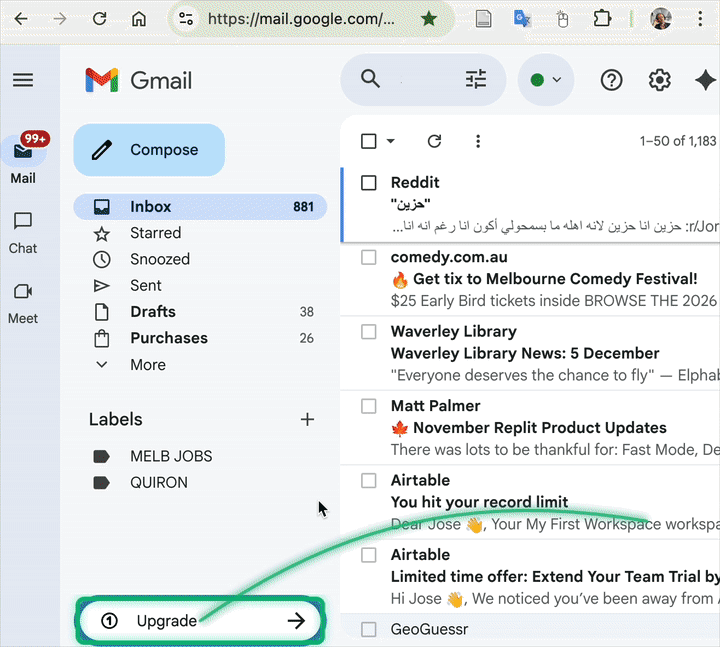

# TabTabGo (AI-TrackPad NU) - A Chrome Extension to reduce RSI-Carpal Tunel Syndrome motion
## Developed @Nazarvayev University
### Open Source

A Chrome and Edge extension that intercepts the Tab key to cycle through the most prominent buttons on a webpage, with special support for Gmail's div-based buttons. Thanks to 

Please send comments or feedback to jose.berengueres (at) nu.edu.kz.

## Features
- **Tab Key Interception**: Intercepts the Tab key to cycle through prominent buttons
- **Gmail Compatible**: Works with Gmail's div elements that have `role="button"`
- **Smart Detection**: Automatically detects the top 10 most prominent buttons based on:
  - Size and visibility
  - Position on the page
  - Z-index and opacity
  - Button-like characteristics
- **Visual Feedback**: Shows a popup in the top-right corner displaying the list of detected buttons
- **Dynamic Updates**: Automatically re-detects buttons when the page content changes

## Installation

1. Open Chrome and navigate to `chrome://extensions/`
2. Enable "Developer mode" (toggle in top-right)
3. Click "Load unpacked"--> download the zip from above 
4. close and restart browser
5. use tab and space or enter to select   
## Usage

1. Navigate to any webpage (works especially well with Gmail)
2. Press the Tab key (when not focused in an input field)
3. The extension will cycle through the detected prominent buttons
4. A popup will appear showing the list of buttons and highlighting the currently focused one
5. The popup auto-hides after 5 seconds, or click the × button to close it manually

## How It Works

The extension:
1. Scans the page for buttons using multiple strategies:
   - Actual `<button>` elements
   - Elements with `role="button"` attribute
   - Clickable elements with button-like characteristics
2. Scores each button based on prominence (size, position, visibility)
3. Sorts and selects the top 10 buttons
4. Intercepts Tab key presses to cycle through them
5. Provides visual feedback with highlighting and a popup list

## Files

- `manifest.json` - Extension configuration
- `content.js` - Main logic for button detection and Tab interception
- `styles.css` - Styling for the popup UI
- `README.md` - This file

## Notes

- The extension only intercepts Tab when you're not focused in an input field
- It works best on pages with clearly defined buttons
- The popup appears automatically when buttons are detected
- Button detection happens on page load and updates dynamically as the page changes

## Other mice

- Berengueres, J., & Yu, T. (2025). *Flexible Ergonomics: Can a Flexible Mouse Fix That Wrist Pain?* **Interactions**, 32(5), 32–37. https://doi.org/10.1145/3759241

- orioli. (2025). *Modified-ISO-9241-9-: Long range Fitts Law test* [Computer software]. GitHub. https://github.com/orioli/Modified-ISO-9241-9-
          

